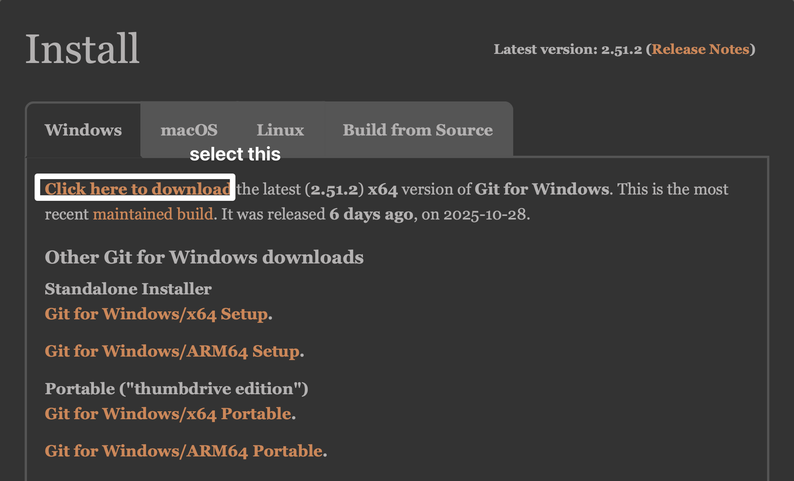

# How To Use Git

1. go to [https://github.com/](https://github.com/) create ur own account.
2. go to [https://git-scm.com/install/windows](https://git-scm.com/install/windows) and install 

3. set git user information
進入終端機設定個人資料
```Bash
git config --global user.name "Your Name"
git config --global user.email "your.email@example.com"
```


1. 給我你創建github acc 的 email，我會把你加入共編

2. clone the repostiry
```Bash
git clone https://github.com/Tingruih/linear_hw1.git
```
clone下來的檔案應該會在c槽user資料夾裡面

1. 會用到的指令
    * git pull origin main(拉取main這個branch上修改的內容)
    * git add .(把這個資料夾底下修改過的檔案放入暫存區)
    * git commit -m "text"（將暫存區的檔案提交到本地倉庫）
    * git push -u origin main

# 遠端repo內容與本地內容不一樣
solution:
保留本地修改且同時拉取遠端內容
```
git add .
git commit -m "?"
git pull --rebase  # 或 git pull --no-rebase
輸入完後會進到vim，按一下esc,輸入:wq,然後enter
```

放棄本地修改，直接將版本重置為遠端repo的
```
git fetch origin
git reset --hard origin/main
```

